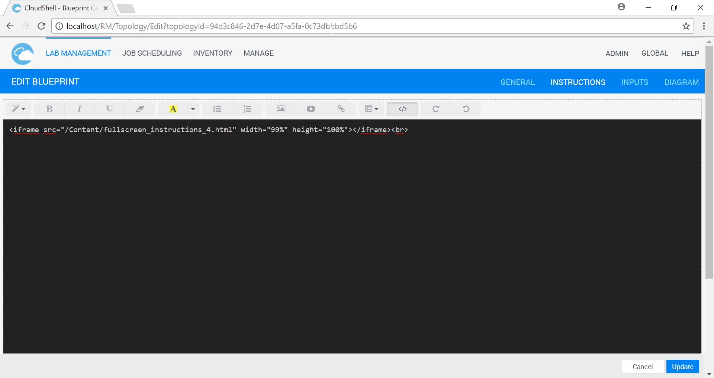
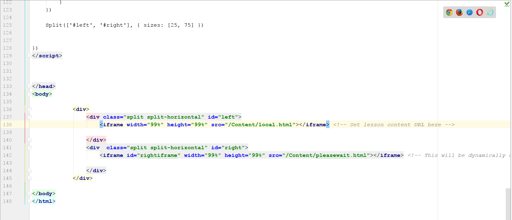
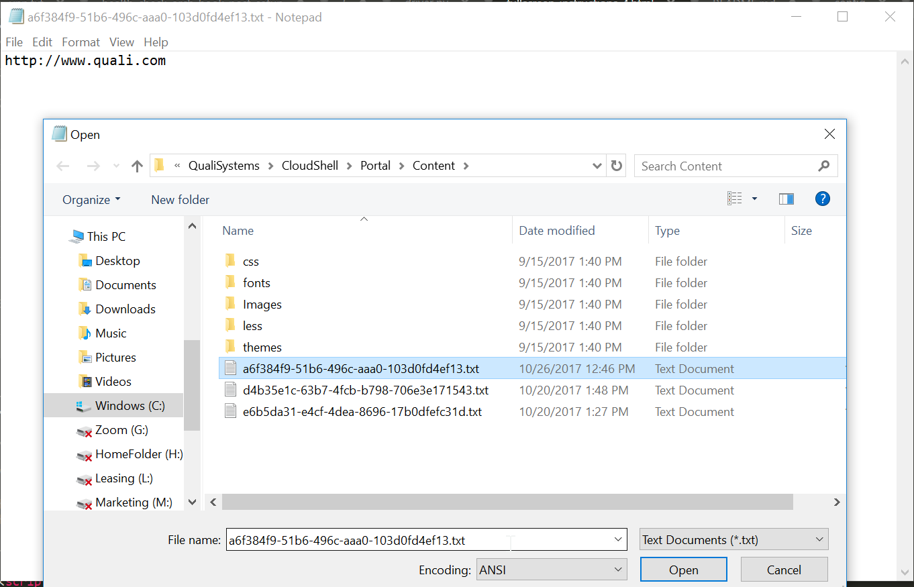
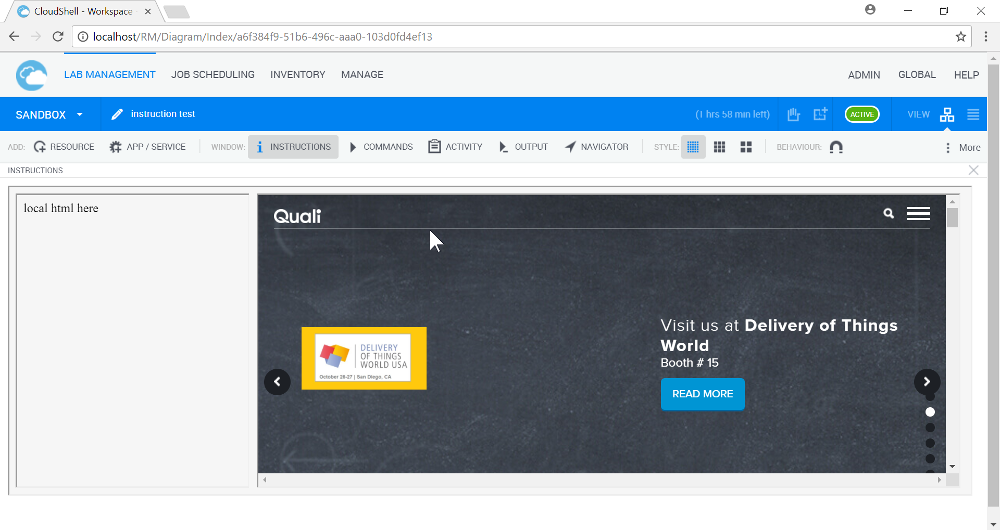
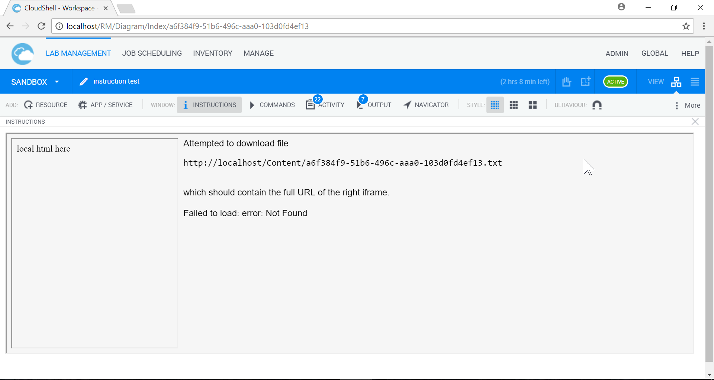
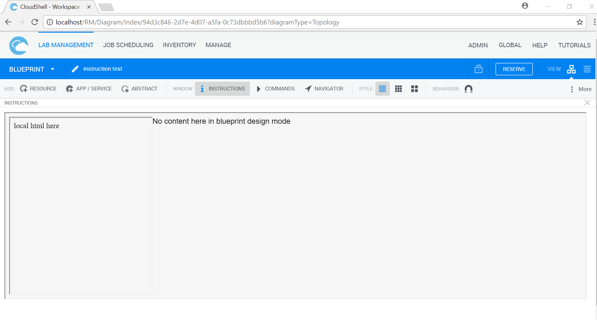

# Dynamic-Instructions-Pane

## Overview

Extends the width of the Instructions pane so it covers the full width of the portal.

Splits the instructions into a left pane for training material and a right pane for capturing a third-party web GUI with a dynamic URL connected to the reservation id.

Uses these third-party components:

https://github.com/nathancahill/Split.js/blob/master/LICENSE.txt

https://github.com/necolas/normalize.css/blob/master/LICENSE.md

## Usage

Copy these files:

		fullscreen_instructions_4.html
		split.js
		normalize.css
		pleasewait.html
		local.html

To folder:

		C:\Program Files (x86)\CloudShell\Portal\Content\

Edit the blueprint instructions in the portal. Switch to code mode using the `</>` button, and set the contents to the following code:

	<iframe src="/Content/fullscreen_instructions_4.html" width="99%" height="100%"></iframe>

Edit the left iframe URL where marked at the bottom of `fullscreen_instructions_4.html`. You can also change the initial splitter from the 25% default. 

By default, the left IFRAME points to `/Content/local.html`. This could point to HTML training content you have copied to the `Content` folder, or to an external site.

In your Setup function, generate this URL and write it to the file:

	C:\Program Files (x86)\CloudShell\Portal\Content\<resid>.txt

When the Instructions pane opens, the right IFRAME is dynamically loaded from a URL taken from a text file generated during Setup: `/Content/<resid>.txt`.

For example:

Setup generates file:

    C:\Program Files (x86)\CloudShell\Portal\Content\a6f384f9-51b6-496c-aaa0-103d0fd4ef13.txt
    
Containing text:
    
	https://123.45.67.89/login?token=12345678&next=/view/blueprint=901234567

Where all three codes in the URL were dynamically obtained by Setup.

When you open the instructions pane, JavaScript code in `/Content/fullscreen_instructions_4.html` will:

- obtain the current reservation id from the parent page
- Download `/Content/<resid>.txt` which contains a URL
- Set the right pane `src` to the URL

An example of a URL file generated by hand, with the test URL http://www.quali.com:

This determines the right pane content in reservation a6f384f9-51b6-496c-aaa0-103d0fd4ef13:

If the URL file was not generated properly:

In blueprint view mode, the right pane is not loaded:

